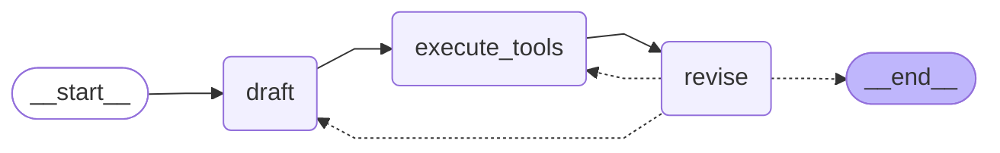

# Reflexion Agent with LangGraph🕸

Implementation of a sophisticated Reflexion agent using LangGraph and LangChain, designed to generate high-quality responses through self-reflection and iterative improvement.

This project demonstrates advanced AI agent capabilities using LangGraph's state-of-the-art control flow mechanisms for self-reflection and response refinement.

## Features

- **Self-Reflection**: Implements sophisticated reflection mechanisms for response improvement
- **Iterative Refinement**: Uses a graph-based approach to iteratively enhance responses
- **Production-Ready**: Built with scalability and real-world applications in mind
- **Integrated Search**: Leverages Tavily search for enhanced response accuracy
- **Structured Output**: Uses Pydantic models for reliable data handling

## Architecture

The agent uses a graph-based architecture with the following components:

- **Entry Point**: `draft` node for initial response generation
- **Processing Nodes**: `execute_tools` and `revise` for refinement
- **Maximum Iterations**: 2 (configurable)
- **Chain Components**: First responder and revisor using GPT-4
- **Tool Integration**: Tavily Search for web research

